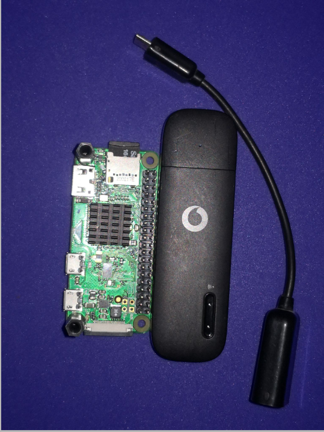

.. _de-select-hardware:

====================
Select Your Hardware
====================

All you need to have is a Raspberry-Pi board. You can use RPI 2,3,4 & Zero. This board model determines the capabilities of your system. 
Using RPI-4 enables you to run video streaming module. This module allows you to connect multiple cameras and stream from them simultaneously.
If you need a telemetry then RPI-Zero is a perfect fit.

.. tip::

      It is recommended to have RPI-Zero for telemetry only and RPI-4 for telemetry + streaming video.

