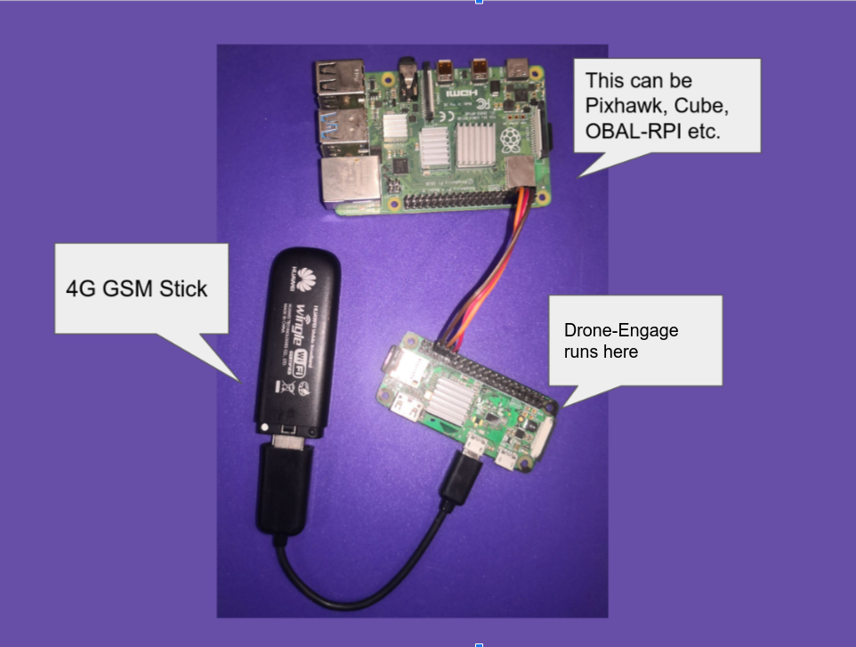

.. _why_droneengage:

.. _what-is-drone-engage:

==================
Why Drone-Engage ?
==================

Drone-Engage (D.E.) is a distibuted system that allows monitoring & controlling drones via Internet. Drone-Engage objective is to provide a Linux-based alternative for Android mobiles.

.. youtube:: https://www.youtube.com/watch?v=F9b4dXLRLjg

|
Now you can use Raspberry-pi boards to run Drone-Engage companion computer software and enjoy tiny size of RPI-Zero, and the multi-camera capabilities or RPI-4.
|

|

Drone-Engage uses on-board Raspberry-Pi Zero connected to `Ardupilot <https://ardupilot.org/>`_ flight control board "FCB" to provide unlimited range telemetry and control. 

.. image:: ./images/rpizeroweight.jpeg
        :align: center
        :alt: Drone-Engage on RPI-Zero

It is only 42 grams is everything you need to take full control on your drone anywhere anytime.

You can connect cameras. Yes not one camera but multiple cameras and stream from all of them at once.

========================================================
Go and try it for Free ... No Credit Cards are required.
========================================================

